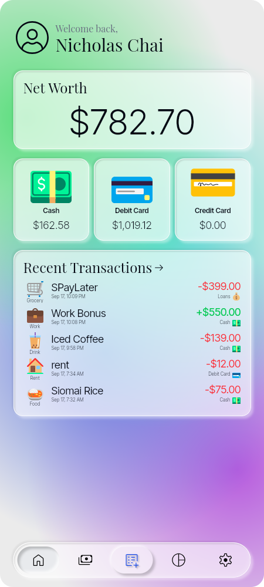
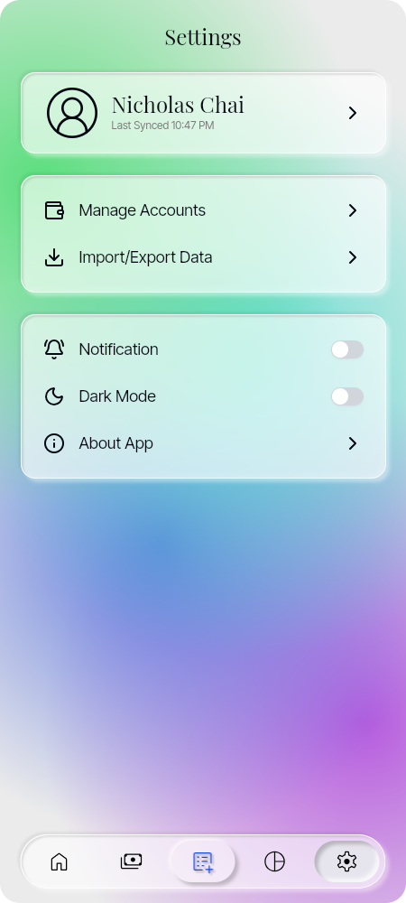

# Project Value

  <p align="center" style="display: flex; gap: 16px; justify-content: center;">
    
    
    
  </p>

  **Project Value** is a minimal, offline-first personal finance app focused on simple and intuitive UX, while leveraging the power of double-entry accounting. Designed for users who want a fast, distraction-free way to track their finances, Project Value emphasizes clarity, speed, and visual delight.

  ## Key Features

  - **Offline-First:** All data is stored locally using SQLite, ensuring privacy and instant access.
  - **Double-Entry Accounting:** Robust, accurate financial tracking with a proven accounting method.
  - **Intuitive UX:** Minimalist design with a focus on ease of use and quick navigation.
  - **Visually Pleasing Emojis:** Emojis are central to the experience, making transaction creation and management fun and instantly recognizable.
  - **Fast Search:** Lightning-fast transaction and account search powered by MiniSearch.
  - **Modern UI:** Built with shadcn/ui and TailwindCSS for a clean, responsive interface.

  ## The Power of Emojis

  Emojis are more than decoration—they are the heart of Project Value’s user experience. By associating accounts, categories, and transactions with expressive, beautiful emojis, the app makes it easy to scan, create, and manage your finances at a glance. This approach simplifies complex financial data and brings joy to everyday money management.

  > **Emoji Attribution:**  
  > Emoji assets are provided by [Microsoft Fluent Emoji](https://github.com/microsoft/fluentui-emoji).

  ## Tech Stack & Key Libraries

  - **[Next.js](https://nextjs.org/):** Modern React framework for fast, scalable UIs.
  - **[Tauri](https://tauri.app/):** Secure, lightweight desktop app runtime.
  - **[SQLite](https://www.sqlite.org/):** Embedded local database for offline data.
  - **[zustand](https://github.com/pmndrs/zustand):** Simple, fast state management.
  - **[react-swr](https://swr.vercel.app/):** Data fetching and caching for React.
  - **[MiniSearch](https://github.com/lucaong/minisearch):** Full-text search in the browser.
  - **[shadcn/ui](https://ui.shadcn.com/):** Accessible, unstyled UI components.
  - **[TailwindCSS](https://tailwindcss.com/):** Utility-first CSS for rapid UI development.

  ### Other Suggestions

  - **Testing:** Consider [Vitest](https://vitest.dev/) for fast unit testing.
  - **Type Safety:** [TypeScript](https://www.typescriptlang.org/) is already in use for robust type checking.
  - **Linting & Formatting:** [Biome](https://biomejs.dev/) and ESLint for code quality.
  - **Cross-Platform:** Tauri enables Windows, Linux, and macOS support.

  ## Getting Started

  ### Prerequisites

  - [pnpm](https://pnpm.io/) (recommended)
  - [Rust](https://www.rust-lang.org/) (for Tauri backend)
  - [Node.js](https://nodejs.org/)

  ### Installation

  1. **Clone the repository:**
     ```sh
     git clone <repo-url>
     cd Project-Value
     ```
  2. **Install dependencies:**
     ```sh
     pnpm install
     ```
  3. **Run in development mode:**
     ```sh
     pnpm tauri dev
     ```

  ### Building for Release

  ```sh
  pnpm tauri build
  ```

  ## Project Structure

  - `src/` – Next.js frontend (React, UI, logic)
  - `src-tauri/` – Tauri backend (Rust, config)
  - `images/` – App screenshots and emoji assets
  - `public/` – Static files and icons

  ## Other App Screenshots

  <p align="center" style="display: flex; gap: 16px; justify-content: center;">
    
    
    
  </p>

  ## Roadmap & Planned Features

  - **Cross-Platform Support:** Web, desktop (Tauri), and mobile (future release) for seamless access everywhere.
  - **Cloud Syncing:** Securely sync your data across devices, with optional end-to-end encryption.
  - **User Authentication:** Sign in to access your data anywhere, with privacy-first options.
  - **Self-Hosting with Docker:** Run your own sync server for maximum control and privacy.

  ## License

  MIT License. See [LICENSE](LICENSE) for details.
